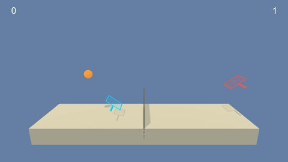

# Udacity Deep Reinforcement Learning Nano Degree - Tennis
This is the submission for the tennis project in Udacity Deep Reinforcement Learning Nano Degree.

# The Environment

In this environment, two agents control rackets to bounce a ball over a net. If an agent hits the ball over the net, it receives a reward of +0.1. If an agent lets a ball hit the ground or hits the ball out of bounds, it receives a reward of -0.01. Thus, the goal of each agent is to keep the ball in play. 

The observation space consists of 8 variables corresponding to the position and velocity of the ball and racket. Each agent receives its own, local observation. Two continuous actions are available, corresponding to movement toward (or away from) the net, and jumping.

The task is episodic, and in order to solve the environment, the agents must get an average score of +0.5 (over 100 consecutive episodes, after taking the maximum over both agents). Specifically, After each episode, we add up the rewards that each agent received (without discounting), to get a score for each agent. This yields 2 (potentially different) scores. Then, the maximum of these 2 scores is taken. This yields a single score for each episode. The environment is considered solved, when the average (over 100 episodes) of those scores is at least +0.5.

# Getting started
**Step 1: Clone the DRLND Repository**  
Please follow the [instructions in the DRLND GitHub repository](https://github.com/udacity/deep-reinforcement-learning#dependencies) to set up your Python environment. These instructions can be found in README.md at the root of the repository. By following these instructions, you will install PyTorch, the ML-Agents toolkit, and a few more Python packages required to complete the project.

(For Windows users) The ML-Agents toolkit supports Windows 10. While it might be possible to run the ML-Agents toolkit using other versions of Windows, it has not been tested on other versions. Furthermore, the ML-Agents toolkit has not been tested on a Windows VM such as Bootcamp or Parallels.

**Step 2: Download the Unity Environment**  
Please download and extract the **tennis** application in the current project from one of the links below. You only need to download the environment that matches your operating system:

Linux: [click here](https://s3-us-west-1.amazonaws.com/udacity-drlnd/P3/Tennis/Tennis_Linux.zip)\
Mac OSX: [click here](https://s3-us-west-1.amazonaws.com/udacity-drlnd/P3/Tennis/Tennis.app.zip)\
Windows (32-bit): [click here](https://s3-us-west-1.amazonaws.com/udacity-drlnd/P3/Tennis/Tennis_Windows_x86.zip)\
Windows (64-bit): [click here](https://s3-us-west-1.amazonaws.com/udacity-drlnd/P3/Tennis/Tennis_Windows_x86_64.zip)

**Step 3: Run the notebook for this project inside drlnd environment**  
> jupyter notebook Tennis.ipynb

**Step 4: Change the path of tennis application**  
Please change the path to the tennis application based on the location of the application in the following command:
> env = UnityEnvironment(file_name="path/to/your/tennis")

**Step 5: Execution**  
The section four (4) is the actual implementation for training and testing the agent. It contains three cells:
- The first cell is for loading modules.
- The second cell is for training the agent with DDPG method.
- The third cell is for testing the agent with trained network. The actor and critic network-weights are loaded from 'checkpoint_actor.pth' and 'checkpoint_critic.pth' files respectively.

If you need to only test the agent with pre-trained model, please skip the training cell.

# Report
The implemented method for the training of the agent is explained in the [report](REPORT.md).

This readme is adapted from Udacity Deep RL Nano Degree course.

