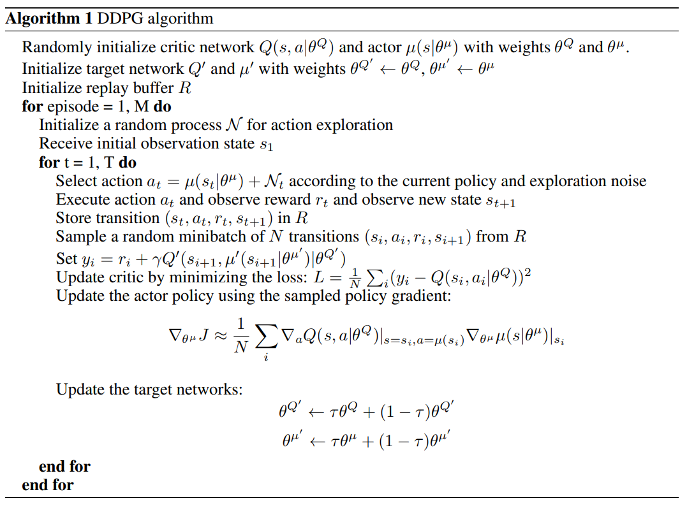
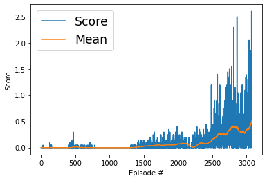

# Method
For the training of the agent, DDPG algorithm is used with the following settings:
- Replay buffer size = 1e5
- Mini batch size = 128
- Replay buffer with uniform sampling
- Learning rate for actor network: 1e-4
- Learning rate for critic network: 1e-4
- TAU to soft update of target parameters: 1e-3
- L2 weight decay: 0
- gamma: 0.99
- Maximum number of steps per episode = INF

# DQN ([Paper](https://arxiv.org/pdf/1509.02971.pdf))

The DDPG implementation is in [ddpg_agent.py](ddpg_agent.py).

# Neural Network Architecture
The model architecture is in [model.py](model.py). Both actor and critic networks consist of two fully connected layers with the size 128 and 128. The input and output for the actor network are state and action respectively. The inputs for the critic network are state and action and the output is 1 which shows the quality of chosen action in that state.

# Results
Here is the plot that shows the score and scores mean per window of the agent in different episodes. 

The agent is able to solve the environment in 3076 episodes with an average score 0.5086 in the last 100 episodes.

Episode 1	Single Agent Score: -0.0050	Average Score: -0.0050\
Episode 2	Single Agent Score: -0.0050	Average Score: -0.0050\
Episode 3	Single Agent Score: -0.0050	Average Score: -0.0050\
Episode 4	Single Agent Score: -0.0050	Average Score: -0.0050\
Episode 5	Single Agent Score: -0.0050	Average Score: -0.0050\
Episode 6	Single Agent Score: -0.0050	Average Score: -0.0050\
Episode 7	Single Agent Score: -0.0050	Average Score: -0.0050\
Episode 8	Single Agent Score: -0.0050	Average Score: -0.0050\
Episode 9	Single Agent Score: -0.0050	Average Score: -0.0050\
...\
...\
...\
Episode 3061	Single Agent Score: 0.1950	Average Score: 0.4360\
Episode 3062	Single Agent Score: 0.5450	Average Score: 0.4395\
Episode 3063	Single Agent Score: 0.3950	Average Score: 0.4390\
Episode 3064	Single Agent Score: 1.0450	Average Score: 0.4495\
Episode 3065	Single Agent Score: 0.0450	Average Score: 0.4495\
Episode 3066	Single Agent Score: 1.8450	Average Score: 0.4650\
Episode 3067	Single Agent Score: 0.0950	Average Score: 0.4660\
Episode 3068	Single Agent Score: 0.5950	Average Score: 0.4690\
Episode 3069	Single Agent Score: 0.1450	Average Score: 0.4690\
Episode 3070	Single Agent Score: -0.0050	Average Score: 0.4675\
Episode 3071	Single Agent Score: 0.1450	Average Score: 0.4625\
Episode 3072	Single Agent Score: 0.5950	Average Score: 0.4625\
Episode 3073	Single Agent Score: 0.5450	Average Score: 0.4670\
Episode 3074	Single Agent Score: 0.1950	Average Score: 0.4690\
Episode 3075	Single Agent Score: 2.6000	Average Score: 0.4941\
Episode 3076	Single Agent Score: 1.4450	Average Score: 0.5086

Environment solved in 3076 episodes!	Single Agent Score: 1.4450	Average Score: 0.5086

# Future works
- To use prioritized experience replay to gain more from valuable replays.
- To implement other actor-critic methods such as AlphaZero, PPO, A2C, A3C, D4PG, and etc. for this environment.
- To implement shared network architecture.

